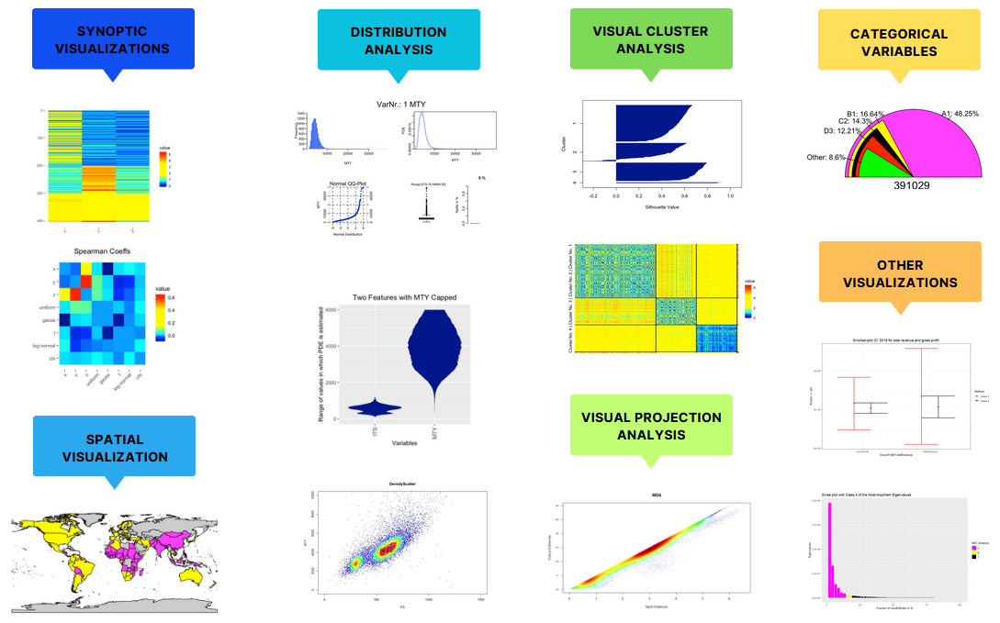
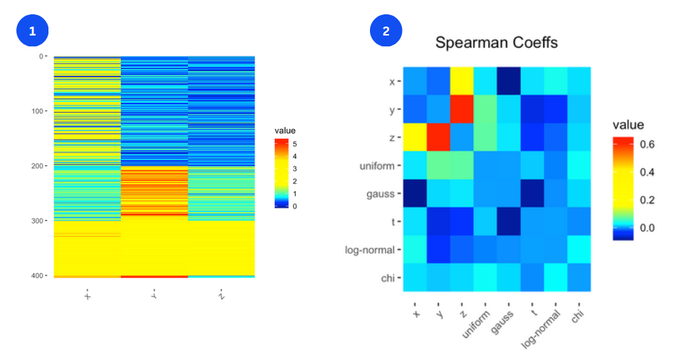
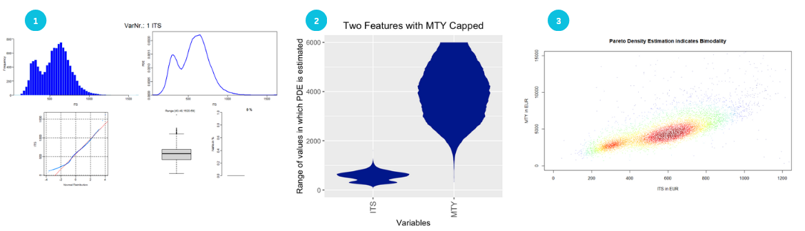
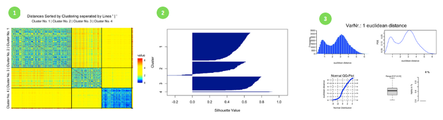

[](https://cran.r-project.org/package=DataVisualizations)
[](https://r-pkg.org/pkg/DataVisualizations)
[](https://r-pkg.org/pkg/DataVisualizations)

# DataVisualizations

### Table of Contents  
[1. Introduction](#introduction)  
[2. Installation](#installation)  
[3. Additional Ressources](#additional)  
[4. References](#references)  


## 1. Introduction
<a name="introduction"/>

“Exploratory data analysis is detective work” [Tukey, 1977, p.2]. This package enables the user to use graphical tools to find ‘quantitative indications’ enabling a better understanding of the data at hand. “As all detective stories remind us, many of the circumstances surrounding a crime are accidental or misleading. Equally, many of the indications to be discerned in bodies of data are accidental or misleading [Tukey, 1977, p.3].” The solution is to compare many different graphical tools with the goal to find an agreement or to generate an hypothesis and then to confirm it with statistical methods. This package serves as a starting point.

The DataVisualizations package offers various visualization methods and graphical tools for data analysis, including:
- **Synoptic visualizations of data:** Synoptic visualization methods such as Pixelmatrices.
- **Distribution analysis and visualization:** Visual distribution analysis for one- or higher dimensional data, including MD Plots and PDE (Pareto Density Estimation).
- **Spatial visualizations:** Spatial visualizations such as choropleth maps.
- **Visual analysis of Clusters, Correlation, Distances and Projections:** Visual analysis of clusters such as Silhouette plots, or visual projection analysis with the Shepard diagrams.
- **Other visualizations:** For example ABC-Barplots, Errorplots and more.




### Examples of synoptic visualizations:

Get synoptic view of the data, with a pixelmatrix

```{}
data("Lsun3D")
Pixelmatrix(Lsun3D$Data)
```

The Pixelmatrix can be used as a shortcut in visualizing Correlations between many variables

```{}
n=nrow(Lsun3D$Data)
Data=cbind(Lsun3D$Data,runif(n),rnorm(n),rt(n,2),rlnorm(n),rchisq(100,2))
Header=c('x','y','z','uniform','gauss','t','log-normal','chi')
cc=cor(Data,method='spearman')
diag(cc)=0
Pixelmatrix(cc,YNames = Header,XNames = Header,main = 'Spearman Coeffs')
```




### Examples of distribution analysis:
                    
InspectVariables provides a summary of the most important plots for one dimensional distribution analysis such as histogram, continuous data density estimation, QQ-Plot, and Boxplot:
```{}
data(ITS)
InspectVariable(ITS)
```

The MD Plot can be used for visualizing the densities of several variables, the MD Plot combines the syntax of ggplot2 with the Pareto density estimation and additional functionality useful from the Data Scientist’s point of view:
```{}
data(MTY)
Data=cbind(ITS,MTY)
MDplot(Data)+ylim(0,6000)+ggtitle('Two Features with MTY Capped')
```

Create density scatter plots in 2D:
```{}
DensityScatter(ITS, MTY, xlab = 'ITS in EUR', ylab ='MTY in EUR', xlim = c(0,1200), ylim = c(0,15000), main='Pareto Density Estimation indicates Bimodality')
```


                      
### Examples of visual cluster analysis:

The heatmap of the distances, ordered by clusters allows to get a synoptic view over the intra- and intercluster distances. Examples and interpretations of Heatmaps and Silhouette plots are presented in [Thrun 2018A, 2018B].
```{}
data("Lsun3D")
Heatmap(Lsun3D$Data,Lsun3D$Cls,method = 'euclidean')
```

Plot Silhuoette plot of clustering:
```{}
Silhouetteplot(Lsun3D$Data,Lsun3D$Cls,PlotIt = T)
```

InputDistances shows the most important plots of the distribution of distances of the data. The distance distribution in the input space can be bimodal, indicating a distinction between the inter- versus intracluster distances. This can serve as an indication of distance-based cluster structures (see [Thrun, 2018A, 2018B]).
```{}
InspectDistances(Lsun3D$Data,method="euclidean")
```




## 2. Installation
<a name="installation"/>

#### Installation using CRAN
Install automatically with all dependencies via

```R
install.packages("DataVisualizations",dependencies = T)
```

#### Installation using Github
Please note, that dependecies have to be installed manually.

```R
remotes::install_github("Mthrun/DataVisualizations")
```

#### Installation using R Studio
Please note, that dependecies have to be installed manually.

*Tools -> Install Packages -> Repository (CRAN) -> DataVisualizations*


## 3. Additional Resources
<a name="additional"/>

- For further examples see [Vignette](https://cran.r-project.org/web/packages/DataVisualizations/vignettes/DataVisualizations.html)
- [Package documentation](https://cran.r-project.org/web/packages/DataVisualizations/DataVisualizations.pdf)
- View package on [CRAN](https://cran.r-project.org/web/packages/DataVisualizations/index.html)

### Tutorial Examples

The tutorial with several examples can be found on in the vignette on CRAN:

https://cran.r-project.org/web/packages/DataVisualizations/vignettes/DataVisualizations.html


### Manual

The full manual for users or developers is available here:
https://cran.r-project.org/web/packages/DataVisualizations/DataVisualizations.pdf


## 4. References
<a name="references"/>
[Thrun, 2018A] Thrun, M. C.: Projection Based Clustering through Self-Organization and Swarm Intelligence, doctoral dissertation 2017, Springer, Heidelberg, ISBN: 978-3-658-20539-3, https://doi.org/10.1007/978-3-658-20540-9, 2018.

[Thrun, 2018B] Thrun, M. C.: Cluster Analysis of Per Capita Gross Domestic Products, Entrepreneurial Business and Economics Review (EBER), Vol. 7(1), pp. 217-231, https://doi.org/10.15678/EBER.2019.070113, 2019.

[Thrun/Ultsch, 2018] Thrun, M. C., & Ultsch, A.: Effects of the payout system of income taxes to municipalities in Germany, in Papiez, M. & Smiech,, S. (eds.), Proc. 12th Professor Aleksander Zelias International Conference on Modelling and Forecasting of Socio-Economic Phenomena, pp. 533-542, Cracow: Foundation of the Cracow University of Economics, Cracow, Poland, 2018.

[Thrun et al., 2020] Thrun, M. C., Gehlert, T. & Ultsch, A.: Analyzing the Fine Structure of Distributions, PLoS ONE, Vol. 15(10), pp. 1-66, DOI 10.1371/journal.pone.0238835, 2020.

[Tukey, 1977] Tukey, J. W.: Exploratory data analysis, United States Addison-Wesley Publishing Company, ISBN: 0-201-07616-0, 1977.
 


